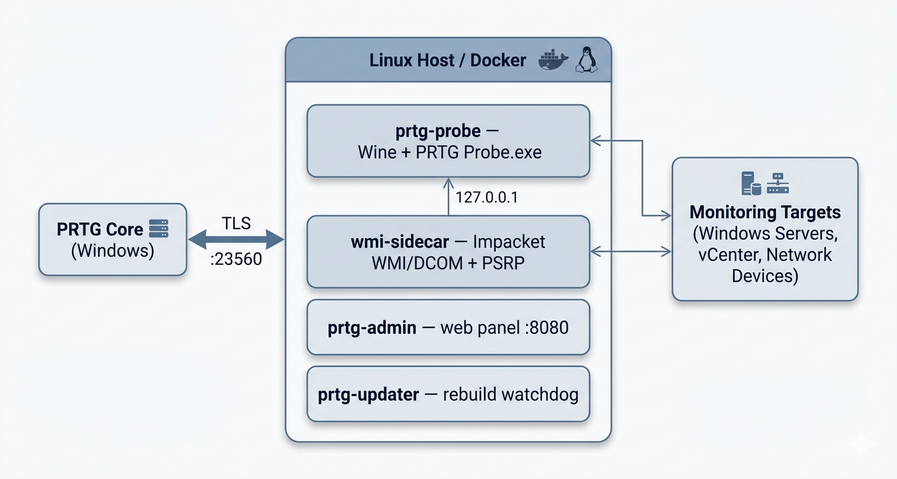
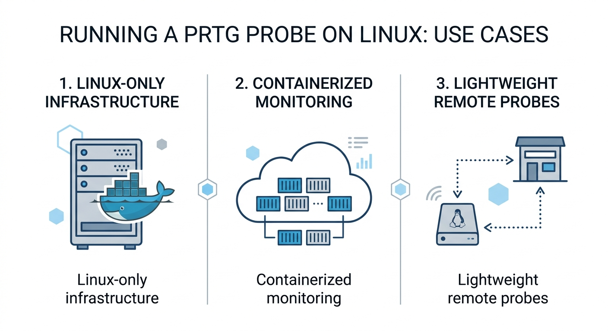
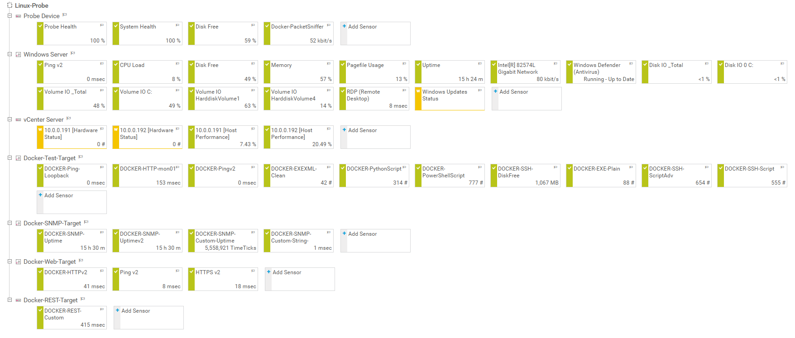
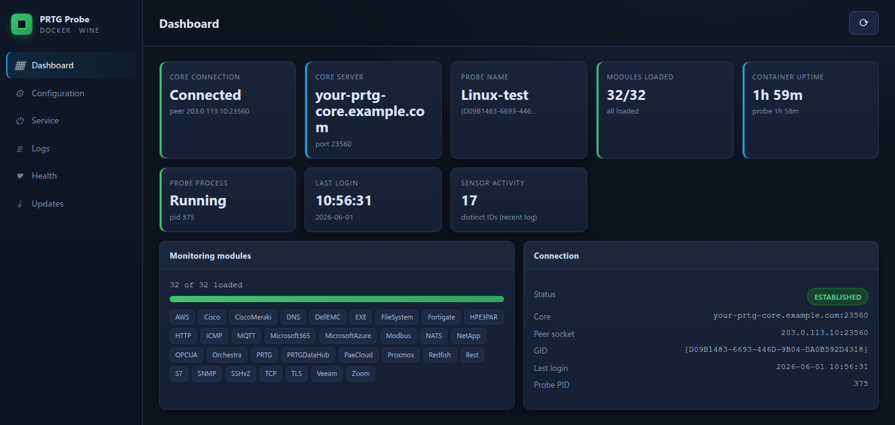

# PRTG Classic Probe on Linux

**Run PRTG's classic Windows probe on Linux. No Windows host needed.**

The 32-bit Delphi `PRTG Probe.exe` runs headless under Wine 11 in Docker, connects out to your existing PRTG core, and monitors like any other remote probe — WMI, SNMP, packet sniffing, .NET sensors and all.



## Why

PRTG remote probes officially require Windows. So if you want eyes in a remote site, a DMZ, or a Linux-only datacenter, you spin up *another Windows box* — license it, patch it, RDP into it, keep it alive.

That gets old fast. Maybe you're a Linux shop and a lone Windows VM is the odd one out. Maybe you want probes that deploy like everything else you run — a container, a compose file, `up -d`. Maybe you just don't want a Windows host babysitting a single service.

This project runs the real probe binary on Linux instead. Same probe, same core, same sensors — in a container, no Windows host in the loop.



> **⚠️ Not an official Paessler product.**
>
> Running the classic PRTG probe under Wine is **not supported by Paessler**, and using this project means forfeiting Paessler support for probe-related issues. This project is **not affiliated with, endorsed by, or sponsored by Paessler AG.** PRTG is a registered trademark of Paessler AG.
>
> **No Paessler software is included or redistributed.** This repo contains no installer, no probe binary, and no monitoring modules — see *Bring your own probe binary* below.

## Quick start

```bash
cd docker
./build-artifacts.sh                                          # build patch artifacts from source
./build-probe.py --installer /path/to/PRTG_Remote_Probe_Installer_*.exe
cp .env.example .env && $EDITOR .env                          # core address, probe key
docker compose up -d
```

Then **approve the new probe** in your PRTG web UI. It's healthy in under two minutes.



Once approved, the container shows up in your PRTG core like any other remote probe — here it's monitoring Windows, vCenter, SNMP, HTTP and custom-script targets, with a live packet sniffer, all from Linux.

Full walkthrough: [docker/QUICKSTART.md](docker/QUICKSTART.md) · production: [docker/DEPLOYMENT.md](docker/DEPLOYMENT.md) · security: [docker/SECURITY.md](docker/SECURITY.md).

## What you get

A four-service `docker compose` stack (everything lives in [docker/](docker/)):

- **`prtg-probe`** — the real probe under Wine 11. Classic sensors, the **32/32** v2 "Momo" modules, native WMI, the .NET *Engine C* helpers, PowerShell sensors, and live packet capture.
- **`wmi-sidecar`** — loopback bridges for the protocols Wine can't do natively: remote **WMI over DCOM** (Impacket) and **PowerShell remoting** (pypsrp).
- **`prtg-admin`** — a small web admin panel that replaces `PRTG Administrator.exe`.
- **`prtg-updater`** — a watchdog that rebuilds and redeploys a clean image when the core pushes a probe update.

The **`prtg-admin`** panel gives you a browser-based replacement for `PRTG Administrator.exe` — connection status, the probe key and core address, monitoring-module inventory, service control, logs and health, all without RDP:



Not every Windows sensor works off-Windows. The supported set and the honest gaps are in [docker/DEPLOYMENT.md](docker/DEPLOYMENT.md) and the per-subsystem docs under [docker/](docker/).

## Wine bug fix included

Getting the signed v2 modules to load surfaced a long-standing bug in Wine's `crypt32` Authenticode verification — present since the code was first written in August 2007 (~18 years). On the verify path, Wine re-encodes a signature's PKCS#7 SignedAttributes in DER-sorted order before hashing them. Windows signs and verifies those attributes in their original on-wire order, which Microsoft `signtool` emits unsorted. When the two orders differ — which is the common case — the recomputed hash never matches the signature and `WinVerifyTrust` returns `TRUST_E_CERT_SIGNATURE` on a perfectly valid signed PE.

The bug stayed hidden because Wine's own conformance tests sign and verify with the same sorting encoder (so the orders always match), and a fresh Wine prefix doesn't register the SOFTPUB trust provider, so most signature checks short-circuit and never reach the code.

The fix hashes the SignedAttributes in their decoded on-wire order on the verify path only, leaving the signing path untouched. It ships with this project's Wine patches and has been submitted upstream to WineHQ. Details in [docker/CERT-IMPORT-FIX.md](docker/CERT-IMPORT-FIX.md).

Getting the probe fully headless surfaced two more Wine bugs along the way, also fixed in this project's runtime layer:

- **`crypt32.dll` — SignedAttributes ordering** (headline, above): the ~2007 Authenticode verify bug that re-sorts attributes before hashing.
- **`kernelbase.dll` — `ImpersonateLoggedOnUser(NULL)`**: Wine returns `FALSE` for a `NULL` token, but Windows treats `NULL` as a sentinel meaning *revert to self* and succeeds. The probe relies on that behaviour.
- **Wine-Mono `mscorlib` — `Console.CursorVisible`**: on a redirected stdout, Wine-Mono returns `false` instead of throwing `IOException` like .NET Framework. The probe's helpers use that throw to detect headless/redirected execution, so without the fix they hang waiting on a console that isn't there.

## Bring your own probe binary

This repo ships **only original work** — scripts, sidecars, the admin panel, the Dockerfiles, the source for the Wine/Mono patches, and documentation. The probe and its monitoring modules are Paessler's and are **never distributed here**.

To build an image, point the tooling at an installer you downloaded from **your own** PRTG core:

```bash
cd docker
./build-artifacts.sh
./build-probe.py --installer /path/to/PRTG_Remote_Probe_Installer_*.exe
```

`build-probe.py` extracts your installer, stages it, builds the images, and emits a ready-to-run `docker-compose.yml` + `.env`. The probe binary ships **vendor-original and unmodified** — every compatibility fix lives in the open-source Wine and Wine-Mono runtime layer. See [docker/BUILD-TOOL.md](docker/BUILD-TOOL.md).

## License

[MIT](LICENSE) — covering this project's original work **only**. It explicitly does **not** cover PRTG Network Monitor or any Paessler software; those remain Paessler's proprietary property and are not distributed with this project.

---

*PRTG and PRTG Network Monitor are registered trademarks of Paessler AG. This project is not affiliated with, endorsed by, or sponsored by Paessler AG.*
