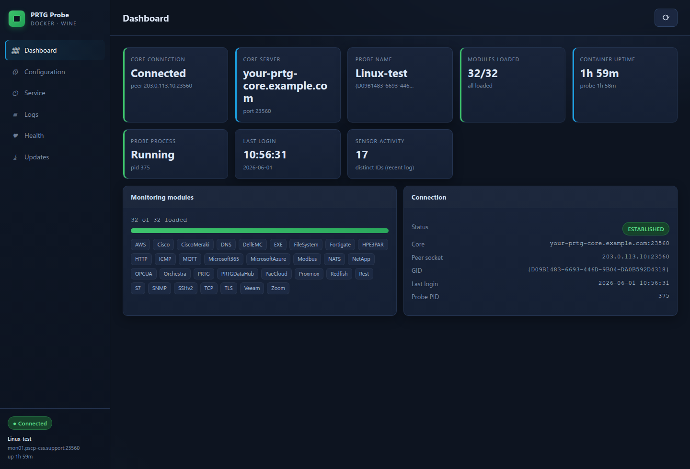
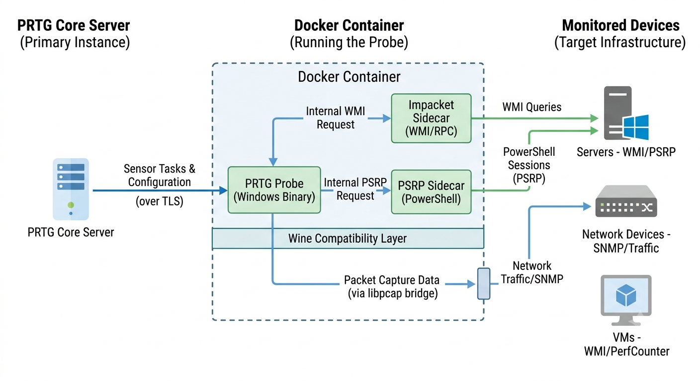

# PRTG Classic Probe on Linux

**Run PRTG's classic Windows probe on Linux. No Windows host needed.**

A headless **PRTG Network Monitor remote probe** running under Wine 11 in Docker. It connects to your existing PRTG core, logs in, and runs sensor classes that normally require Windows — native WMI, the .NET *Engine C* helpers, the classic packet sniffer — all from a Linux container, with sidecars covering the protocols Wine can't do natively.

> **⚠️ Not an official Paessler product.**
>
> Running the classic PRTG probe under Wine is **not supported by Paessler**, and using this project means forfeiting Paessler support for probe-related issues. This project is **not affiliated with, endorsed by, or sponsored by Paessler AG.** PRTG is a registered trademark of Paessler AG.
>
> **No Paessler software is included or redistributed.** You supply your own probe installer — downloaded from your own PRTG core — and hold a valid PRTG license that permits its use. The probe binary ships **vendor-original and unmodified**; all compatibility work happens in the open-source Wine and Wine-Mono runtime layer.

## Why

PRTG remote probes officially require a Windows host. Want a probe in a remote site, a DMZ, or a Linux-only datacenter? You stand up another Windows box, license it, patch it, and keep it alive — just to run one service.

This runs the real probe binary on Linux instead. Same probe, same core, same sensors — as a container you deploy like everything else: a compose file and `up -d`. No Windows host in the loop.

## Quick start

You need a Linux host with Docker + the compose plugin, network reach to your core's probe port, and your own **PRTG probe installer** (the project never ships Paessler's binary).

```bash
git clone <this-repo> prtg-classic-probe-linux && cd prtg-classic-probe-linux/docker
cp .env.example .env && $EDITOR .env          # set CORE_SERVER, CORE_IP, PROBE_KEY
./build-artifacts.sh                          # build patch artifacts from source
./build-probe.py --installer /path/to/PRTG_Remote_Probe_Installer_*.exe   # or: docker load -i *.tar
docker compose up -d                          # probe + sidecars + admin + updater
docker compose logs -f prtg-probe             # watch for "Login OK" (healthy in <2 min)
```

Then **approve the new probe** in your PRTG web UI. Full walkthrough: [QUICKSTART.md](QUICKSTART.md) · production: [DEPLOYMENT.md](DEPLOYMENT.md).



## How it works



Four services, one compose stack:

- **prtg-probe** — the Delphi `PRTG Probe.exe` under Wine. Talks to your core over the standard probe link (TLS, port 23560) exactly like a Windows probe.
- **wmi-sidecar** — Impacket DCOM/WMI. Wine's WMI is local-only, so the probe's native WMI sensors are forwarded here and run real remote WMI against Windows targets.
- **psrp-sidecar** — pypsrp WSMan/PSRP for PowerShell-based sensors (Windows Updates, Exchange).
- **prtg-admin** — a web replacement for *PRTG Administrator.exe*, on `:8080`.
- **prtg-updater** — a watchdog that intercepts core-pushed probe updates and rebuilds a clean image instead of an in-place Wine reinstall.

The probe binary is never modified. Each Windows gap is closed in the runtime layer instead:

| Conventional constraint | How this project handles it |
| --- | --- |
| Remote probes require a Windows host | The probe runs headless under Wine in a container, connects and logs in cold |
| WMI sensors need a Windows probe | Native WMI returns live data via an Impacket sidecar + a COM facade |
| The packet sniffer needs an Npcap/WinPcap driver | Wine's `wpcap.dll` bridges to libpcap (kernel `AF_PACKET`); live capture, no driver |
| .NET "Engine C" sensors need the Windows .NET Framework | They run on **Wine-Mono** — VMware and SQL return live data |
| The signed v2 modules won't load off Windows | All **32/32** load — a Wine `crypt32` fix correctly verifies their genuine Paessler signatures, which stock Wine mis-rejects |

## Wine bug fix included

That last row uncovered a long-standing bug in Wine's `crypt32` Authenticode verification, present since the code was written in August 2007 (~18 years). On the verify path Wine re-encodes a signature's PKCS#7 SignedAttributes in DER-sorted order before hashing, but Windows signs and verifies them in their original on-wire order (as Microsoft `signtool` emits them, unsorted). When the orders differ — the common case — the recomputed hash never matches and `WinVerifyTrust` returns `TRUST_E_CERT_SIGNATURE` on a valid signed PE.

The fix hashes the attributes in their on-wire order on the verify path only, leaving the signing path unchanged. It ships with this project's Wine patches and has been submitted upstream to WineHQ — see [CERT-IMPORT-FIX.md](CERT-IMPORT-FIX.md).

Getting the probe fully headless surfaced two more Wine bugs along the way, also fixed in this project's runtime layer:

- **`crypt32.dll` — SignedAttributes ordering** (headline, above): the ~2007 Authenticode verify bug that re-sorts attributes before hashing.
- **`kernelbase.dll` — `ImpersonateLoggedOnUser(NULL)`**: Wine returns `FALSE` for a `NULL` token; Windows treats `NULL` as a *revert to self* sentinel and succeeds, which the probe relies on.
- **Wine-Mono `mscorlib` — `Console.CursorVisible`**: on a redirected stdout, Wine-Mono returns `false` instead of throwing `IOException` like .NET Framework, breaking the helpers' headless-execution detection.

## Features

- **Connects as a normal remote probe** — appears, approves, goes **Up** against a stock PRTG core
- **Classic sensors** — HTTP, Ping, SNMP, port/TCP, DNS and friends (Engine A)
- **v2 "Momo" modules** — all **32/32** load (HTTP v2, Ping v2, SNMP v2, NATS bus, …)
- **Native WMI** — live CPU/disk/memory/service sensors via the Impacket sidecar
- **.NET "Engine C"** — VMware/vSphere and SQL (ADO.NET) return live data on Wine-Mono
- **PowerShell sensors** — Windows Updates and Exchange over PSRP
- **Packet sniffer** — real packet capture via Wine `wpcap` → libpcap, no driver
- **Custom sensors** — EXE/Script Advanced, Python, PowerShell, SSH — all live
- **Auto-update aware** — core-pushed updates rebuild a fresh image, zero-gap
- **Web admin panel** — status, config, modules, logs, health on `:8080`
- **One generic image** — carries no identity; point it at any core via `.env`

## Sensor support matrix

| Sensor family | Status | How it works |
| --- | :---: | --- |
| HTTP · Ping · SNMP · TCP/Port · DNS (classic Engine A) | Live | Native Wine. Ping needs host `net.ipv4.ping_group_range`. |
| v2 "Momo" modules — HTTP v2, Ping v2, SNMP v2, NATS … (32/32) | Live | Wine `crypt32` Authenticode fix verifies the modules' valid Paessler signatures; modules unchanged. |
| Packet Sniffer (`snifferheader` / `sniffercustom`) | Live | Wine `wpcap` → libpcap, kernel `AF_PACKET`. Needs `NET_RAW`/`NET_ADMIN`. |
| Native WMI (CPU, disk, memory, service …) | Live | Impacket `wmi-sidecar` + `wbemfacade` / patched `wbemdisp`. |
| .NET Engine C — VMware / vSphere | Live | Wine-Mono; SOAP perf data from vCenter. |
| .NET Engine C — SQL (ADO.NET / Npgsql …) | Live | Wine-Mono; headless console mode. |
| PowerShell "Windows Updates Status" sensor | Live | `psrp-sidecar` (WSMan); 16 live channels. |
| Exchange (PSRP) | Live | `psrp-sidecar`. |
| Custom EXE/Script Advanced (EXEXML), Python, PowerShell, SSH | Live | Native + bridge to host `python3` / `pwsh` / `ssh`. |
| Sensors bound to local Windows-only APIs with no backend | Partial | Run, but no data source under Wine. |
| GUI / WinForms-bound sensor helpers | No | Need a real Windows desktop. |

Deep dives: [WMI / Engine-C .NET](DOTNET-ENGINE-C.md) · [PowerShell / PSRP](ENGINE-C-POWERSHELL.md) · [Module signatures (Wine Authenticode fix)](CERT-IMPORT-FIX.md) · [Packet sniffer (ICMP / module loading)](ICMP-MODULE-FIX.md) · [State persistence](PERSISTENCE.md).

## Tested on

| | |
| --- | --- |
| **Wine** | 11.0 (winehq-stable, pinned) · Wine-Mono 10.4.1 |
| **Host OS** | Debian Bookworm |
| **Docker** | 24+ with the compose plugin |
| **Architecture** | amd64 (x86-64) — the probe is 32-bit x86 |
| **PRTG** | 26.x core + probe installer |

## Limitations

- **IPv4 only** — no IPv6 monitoring path.
- **amd64 only** — `PRTG Probe.exe` is 32-bit x86; arm64 hosts won't run it.
- **WMI and PSRP go through sidecars** — there is no native Windows .NET 4.8 or DCOM stack; remote WMI and PowerShell sensors are bridged through the Impacket / pypsrp sidecars.
- **SCVMM is unsupported** — `SCVMMSensor.exe` hits a `Paessler.Config` constructor version-skew that throws `MissingMethodException` at startup — on genuine Windows PRTG too. The vendor binary ships as-is rather than transformed.
- **Local Windows-surface sensors** (local performance counters, local event log, Windows-only local APIs) have no backend under Wine.
- **GUI / interactive-desktop** sensor helpers won't run headless.
- **Pinned compatibility** — fixes are tied to Wine 11.0 / Wine-Mono 10.4.1. The build is version-guarded and **fails rather than mis-applying** if the probe binary or Wine version changes unexpectedly. No forward-compatibility guarantee.
- **Single-host trust model** — the stack uses the host network namespace and assumes a host you control. Read [SECURITY.md](SECURITY.md) before exposing it.

## Support boundaries

| Issue area | Where to go |
| --- | --- |
| Wine compatibility, Docker container issues, sidecars, build failures, admin panel | This project's issue tracker |
| PRTG core server, licensing, sensor configuration, PRTG web UI | [Paessler support](https://www.paessler.com/support) (**note:** Paessler may decline support for Wine-based probe deployments) |

This project maintains the Wine/Docker compatibility layer only. Paessler AG has no obligation to support probes running under Wine — if you contact Paessler support, expect to be asked to reproduce on a native Windows probe first.

## Documentation

| Doc | What it covers |
| --- | --- |
| [QUICKSTART.md](QUICKSTART.md) | Zero-to-Up with the pre-built images |
| [DEPLOYMENT.md](DEPLOYMENT.md) | Full production deployment + compose reference + sensor support matrix |
| [SECURITY.md](SECURITY.md) | Threat model, hardening, what to lock down |
| [BUILD-TOOL.md](BUILD-TOOL.md) | The `build-probe.py` package builder |
| [CERT-IMPORT-FIX.md](CERT-IMPORT-FIX.md) | The Wine `crypt32` Authenticode-verification fix |
| [DOTNET-ENGINE-C.md](DOTNET-ENGINE-C.md) | WMI facade + .NET Engine-C helpers |
| [ENGINE-C-POWERSHELL.md](ENGINE-C-POWERSHELL.md) | PSRP bridge for PowerShell sensors |
| [WMI-ANALYSIS.md](WMI-ANALYSIS.md) | Why remote WMI fails under stock Wine + the bridge architecture |
| [WMI-FACADE.md](WMI-FACADE.md) | The WbemScripting facade for native WMI |
| [CUSTOM-SENSORS.md](CUSTOM-SENSORS.md) | EXE/Script, Python, PowerShell, SSH custom sensors |
| [AUTO-UPDATE.md](AUTO-UPDATE.md) | Core-pushed update interception + rebuild |
| [PERSISTENCE.md](PERSISTENCE.md) | What survives a container recreate |

## License

This project's original code (scripts, sidecars, facade, admin panel, Dockerfiles, docs) is released under the [MIT License](LICENSE). **The PRTG probe binary itself is Paessler AG's proprietary software and is not included or redistributed** — you must download the installer from your own PRTG core server and hold a valid PRTG license that permits its use.

---

*PRTG and PRTG Network Monitor are registered trademarks of Paessler AG. This project is not affiliated with, endorsed by, or sponsored by Paessler AG.*
